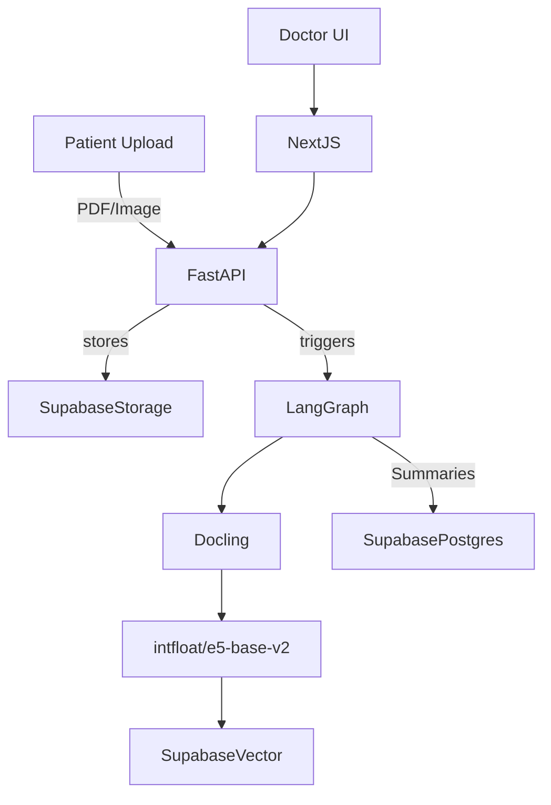

# MediTrack AI Architecture

## Overview

MediTrack AI uses Supabase as the single source of truth (auth, storage, Postgres, vector search) and orchestrates Docling + LangGraph agents through a FastAPI backend. A Next.js 15 frontend consumes RBAC-protected APIs.

## Agents

1. **Ingestion Agent** (Docling)
   - Parses PDFs/images into canonical sections.
   - Normalizes metadata (patient id, document type, capture date).
   - Sends chunks for embeddings.
   - Logs `chunks_upserted` audit events.

2. **Summarization Agent** (Mistral 7B Instruct)
   - Produces patient-friendly + clinician summaries.
   - Flags abnormal lab values using templated prompts.
   - Persists JSON summaries to `patient_summaries`.

3. **RAG Query Agent**
   - Embeds question with `intfloat/e5-base-v2`.
   - Calls Supabase RPC `match_patient_vectors`.
   - Builds context window before calling Mistral.
   - Emits audit entries describing match counts.

4. **Guardrail Agent**
   - Re-validates outputs.
   - Enforces "no data → explicit refusal".
    - Captures whether citations were available in `agent_audit_logs`.

## Data Persistence

- `patients`: master record for demographics, alerts, medications, lab snapshots (jsonb fields).
- `patient_vectors`: pgvector table for RAG chunks (ingestion pipeline writes via service role).
- `patient_summaries`: append-only log storing outputs from LangGraph summarization agent.
- `agent_audit_logs`: traces ingestion, retrieval, and guardrail decisions for compliance/auditing.

Supabase Row Level Security should allow Patients to read only their rows, Doctors to read assigned patients, and Admins to view everything. Backend ingestion uses the service-role key, so store it server-side only.

## Guardrails

- Retrieval guardrail: fallback message when `match_patient_vectors` returns nothing.
- RBAC guardrail: Supabase RLS ensures each role only reads allowed rows.
- Prompt guardrails: templated instructions removing diagnosis claims.

## Deployment

- **Supabase**
  - Auth policies for `patients`, `patient_vectors`, `patient_summaries`, `agent_audit_logs`.
  - Storage bucket `patient_data` with folder per patient.
  - SQL snippet for RPC included in README.
- **Railway**
  - Configured via `backend/railway.toml` (Nixpacks + uvicorn start command).
- **Next.js Frontend**
  - Deploy via Vercel (`frontend/vercel.json`) or Railway static build.
  - Environment variables pulled from Supabase + backend.

